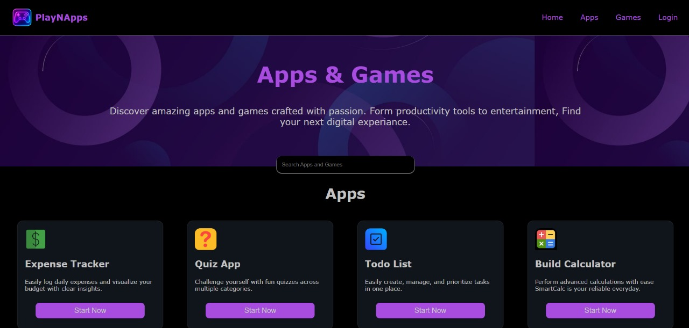

## 🎮 PlayNApp

- PlayNApp brings you endless entertainment with a wide range of casual and fun games, all in one app. wheather you love puzzles,action,strategy,or quick challeges, PlayNApp has something for everyone.

## 💡Features
- 🎮play multiple games without extra downloads.
- ⚡fast loading & smooth gameplay.
- 📱Fullscreen mode.
- 🏆Daily challenges and rewards.
- 👥 Fun for all age groups.
- ✅ fully responsive structure.

## 🌐 Live Preview
- Hosted on Netlify
- Click on - https://playnapps.netlify.app/

## 🛠️ Technologies Used

- HTML5

- CSS3

- javascript

## 📂 Project Structure
├── index.html → Main Homepage
├── style.css → CSS Styling File ├── script.js → javascript file ├── images/ → Contains all image assets ├── pages/ → Contains all pages ├── games/ → Contains all games

## 🚀 How to Run
Download or Clone this repository

Open index.html in your browser

Explore the PlayNApp homepage

📸 Screenshot

## Home Page -

## File Structure -

## 🙌 Acknowledgements
👉 We sincerely thank our users for choosing Playnapp. Your support, feedback, and love inspire us to keep improving and adding more fun experiences for everyone.

##  Contributors  🤝

Made with [contrib.rocks](https://contrib.rocks).